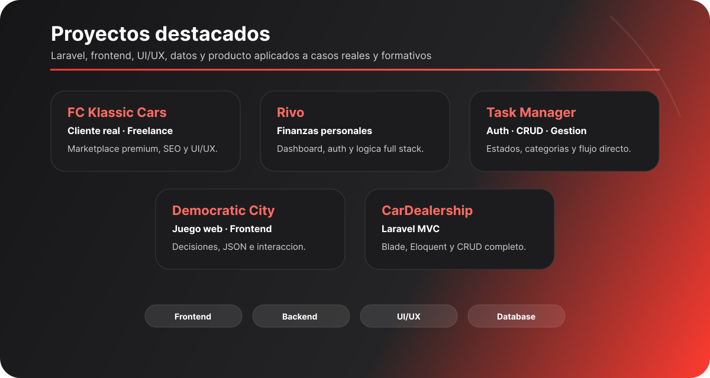

  

<h1 align="center">Construyo Productos Donde la Lógica se encuentra con el Código.</h1>

  

  

  <a href="https://angel-guiberteau.github.io/Portfolio-AngelGF/">Portfolio</a>
  ·
  <a href="mailto:aguiberteaufranco@gmail.com">Email</a>
  ·
  <a href="https://www.linkedin.com/in/%C3%A1ngel-guiberteau-franco">LinkedIn</a>
  ·
  <a href="https://github.com/Angel-Guiberteau">GitHub</a>

  

## Perfil profesional

Soy **Desarrollador de Aplicaciones Web** y actualmente **Responsable de Frontend** en **THB Hotels**. Mi enfoque se basa en crear soluciones digitales claras, eficientes y orientadas a la experiencia del usuario, combinando diseño, lógica, arquitectura frontend y arquitectura de producto.

Trabajo como **desarrollador full stack especializado en Laravel y frontend**, integrando diseño **UI/UX**, desarrollo frontend, componentes reutilizables y contribuciones en backend. También estoy ampliando mi perfil hacia **IA aplicada**, **APIs de IA**, BigData y análisis de datos para construir soluciones más inteligentes, escalables y útiles.

### Frontend, Backend e IA + BigData

- **Frontend & UI:** trabajo con JavaScript, TypeScript, React, Inertia, Astro, Blade, Bootstrap, HTML5, CSS3, WordPress, UI/UX y SEO para crear interfaces claras, consistentes y fáciles de mantener.
- **Backend & Core:** desarrollo aplicaciones full stack con Laravel, PHP, Composer, Eloquent, APIs REST, Blade, MySQL e integraciones, cuidando la estructura del proyecto y la lógica de negocio.
- **IA + BigData:** aplico Python, Machine Learning, TensorFlow, APIs de IA, LLMs, Prompt Engineering, Jupyter, Google Colab y Kaggle para analizar datos, experimentar con modelos y construir soluciones más inteligentes.

## Experiencia destacada

### THB Hotels

**Responsable de Frontend & Full Stack Developer**

Desarrollo aplicaciones internas, webs públicas y soluciones corporativas con foco en **Laravel**, **frontend**, **UI/UX**, arquitectura frontend y experiencia de usuario.

También participo en backend, diseño de APIs, optimización y evolución de un paquete interno corporativo que unifica componentes, patrones visuales y criterios técnicos.

**Tipo:** corporativo privado  
**Producto:** intranet, herramientas internas, webs públicas y componentes compartidos  
**Rol:** arquitectura frontend, full stack, UI/UX, APIs y Backend

  

## Stack técnico

  

  

## Proyectos destacados

  

### FC Klassic Cars

<kbd>Cliente real</kbd> <kbd>Freelance</kbd> <kbd>Diseño</kbd> <kbd>SEO</kbd> <kbd>Desarrollo</kbd>

Marketplace para vehículos clásicos y de lujo con experiencia visual premium, enfoque comercial y estructura orientada a presencia de marca.

**Foco visual:** experiencia premium, frontend comercial, UI/UX, SEO y conversión.  
**Stack principal:** <kbd>Laravel</kbd> <kbd>Bootstrap</kbd> <kbd>MySQL</kbd> <kbd>UI/UX</kbd> <kbd>SEO</kbd>  
**Enlace:** [fcklassic.com](https://fcklassic.com/)

---

### Rivo

<kbd>Proyecto Fin de Grado</kbd> <kbd>Full Stack</kbd> <kbd>Dashboard</kbd>

Aplicación web de finanzas personales centrada en dashboard, autenticación, lógica de negocio y experiencia de usuario.

**Foco visual:** dashboard claro, frontend funcional, autenticación y lógica de negocio.  
**Stack principal:** <kbd>Laravel</kbd> <kbd>Blade</kbd> <kbd>Bootstrap</kbd> <kbd>JavaScript</kbd> <kbd>API REST</kbd>  
**Enlace:** [Rivo](https://github.com/Angel-Guiberteau/Rivo)

---

### Task Manager

<kbd>Full Stack</kbd> <kbd>Auth</kbd> <kbd>CRUD</kbd>

Aplicación de gestión de tareas con autenticación, categorías, estados y una interfaz directa para organizar flujos de trabajo.

**Foco visual:** interfaz directa, estados, categorías y experiencia de gestión.  
**Stack principal:** <kbd>Laravel</kbd> <kbd>Blade</kbd> <kbd>Eloquent</kbd> <kbd>Bootstrap</kbd> <kbd>Auth</kbd>  
**Enlace:** [TaskManager](https://github.com/Angel-Guiberteau/TaskManager)

---

### Democratic City

<kbd>Juego web</kbd> <kbd>Frontend</kbd> <kbd>Datos JSON</kbd>

Proyecto multijugador en navegador basado en decisiones colectivas que afectan a indicadores de ciudad mediante JavaScript y JSON.

**Foco visual:** lógica frontend, interacción multijugador, datos JSON y experiencia en navegador.  
**Stack principal:** <kbd>HTML5</kbd> <kbd>CSS3</kbd> <kbd>JavaScript</kbd> <kbd>Fetch API</kbd> <kbd>JSON</kbd>  
**Enlace:** [Democratic City](https://github.com/Angel-Guiberteau/DemocraticCity)

---

### CarDealership

<kbd>Formación dual</kbd> <kbd>Laravel MVC</kbd> <kbd>CRUD</kbd>

Proyecto académico para simular un concesionario y reforzar arquitectura MVC, Eloquent, Blade y flujos CRUD completos.

**Foco visual:** arquitectura MVC, frontend con Blade, flujos CRUD y gestión de datos.  
**Stack principal:** <kbd>Laravel</kbd> <kbd>MVC</kbd> <kbd>Blade</kbd> <kbd>Eloquent</kbd> <kbd>Bootstrap</kbd>  
**Enlace:** [CarDealership](https://github.com/Angel-Guiberteau/CarDealership)

---

### IA + BigData

<kbd>Formación superior</kbd> <kbd>En curso</kbd> <kbd>Datos</kbd>

Especialización en inteligencia artificial, machine learning, análisis de datos, IA APIs y experimentación con Python y TensorFlow.

**Foco visual:** análisis de datos, modelos, LLMs, notebooks y sistemas orientados a datos.  
**Stack principal:** <kbd>Python</kbd> <kbd>TensorFlow</kbd> <kbd>IA APIs</kbd> <kbd>Jupyter</kbd> <kbd>Colab</kbd> <kbd>Kaggle</kbd>  
**Enlace:** [Sobre mí](https://angel-guiberteau.github.io/Portfolio-AngelGF/about.html)

  

## Trayectoria

  

## Idiomas y contacto

  

### Lectura rápida

**Idiomas**  
<kbd>Español nativo</kbd> <kbd>Inglés fluido</kbd> <kbd>Francés básico</kbd>

**Disponibilidad**  
Abierto a oportunidades donde pueda aportar en **frontend**, **Backend**, **UI/UX**, producto digital e integración de IA aplicada.

**Ubicación**  
<kbd>Badajoz, España</kbd> <kbd>Remoto / híbrido</kbd>

### Enlaces

**Portfolio** · [Portfolio-AngelGF](https://angel-guiberteau.github.io/Portfolio-AngelGF/)  
**Email** · [aguiberteaufranco@gmail.com](mailto:aguiberteaufranco@gmail.com)  
**LinkedIn** · [Ángel Guiberteau Franco](https://www.linkedin.com/in/%C3%A1ngel-guiberteau-franco)  
**GitHub** · [Angel-Guiberteau](https://github.com/Angel-Guiberteau)

  

